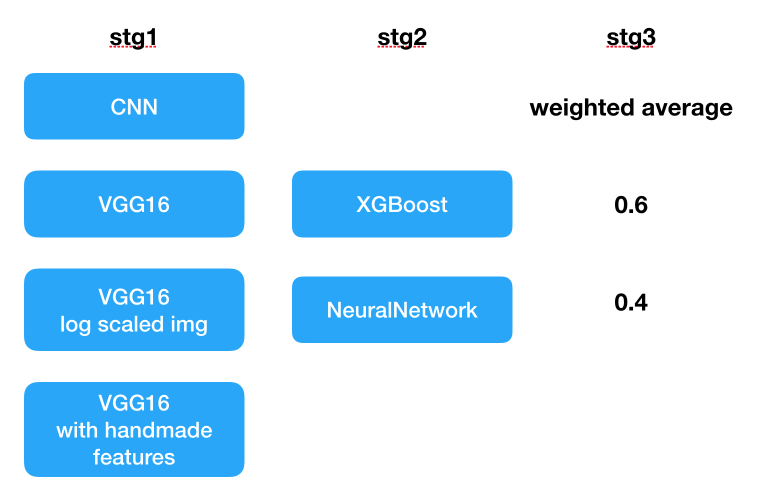

# ML starter

This project is a starter kit for machine learning project. I built it during Kaggle competition. But it can be used in any real world project.

There are only 4 short core scripts. It's highly customizable for specific demands.

## What's included

* Stacking, Blending.
  * Stack numpy binary files. Each scripts of model can be completely separated.
* Support any kinds of models, DNN, XGBoost, RandomForest and etc.
* Hyper parameter tuning using [hyperopt](https://github.com/hyperopt/hyperopt).
  * Trials can be persisted and resumed.
  * Trial history viewer.
* Cross validation.
* Bagging.
* Binary classification and multiclass classification.

## How to use

### Defining models and stacking architecture

This repository contains some examples for minist.

* [stg1_00_data.py](stg1_00_data.py)
* [stg1_01_cnn4l.py](stg1_01_cnn4l.py)
* [stg1_02_lr.py](stg1_02_lr.py)
* [stg2_00_data.py](stg2_00_data.py)
* [stg2_01_lgb.py](stg2_01_lgb.py)

These files represent following stacking architecture.


If you want, any kinds of stacking and averaging are possible.



### Hyper Parameter tuning

Once these scripts are made, it's ready to run hyper parameter tuning.

```
python stg1_01_cnn4l.py --max_iter=20 --trial_steps=1
```

This command runs 20 trials. The result of trials will be saved as ```artifacts/stg1/01_cnn4l_trials.pickle```. As ```trial_steps=1``` is specified, this file will be saved after for each trials.

Let's take a look at the result.
```
$ python trials_viewer.py --trials_file artifacts/stg1/01_cnn4l_trials.pickle
Best 10 trials
    batch_size  dropout1        lr  score_tr  score_val            book_time
14        48.0  0.323717  0.000631  0.129751   0.161268  2018-01-26 05:30:04
13        24.0  0.508371  0.000856  0.155145   0.184446  2018-01-26 05:27:21
19        24.0  0.182715  0.000180  0.150898   0.185298  2018-01-26 05:56:48
3         24.0  0.484073  0.000429  0.157420   0.192407  2018-01-26 04:44:13
2         64.0  0.441295  0.000560  0.165565   0.200870  2018-01-26 04:41:30
4         48.0  0.409091  0.000315  0.174792   0.205657  2018-01-26 04:47:47
11        48.0  0.422387  0.000155  0.286364   0.316847  2018-01-26 05:13:34
12         8.0  0.742590  0.000134  0.305762   0.333610  2018-01-26 05:16:47
7         32.0  0.810629  0.000367  0.306370   0.336706  2018-01-26 05:00:10
6         16.0  0.658904  0.000081  0.393736   0.418175  2018-01-26 04:54:33
{'batch_size': 48.0,
 'dropout1': 0.3237174030027785,
 'lr': 0.0006307707881491349}
```

Then, copy and paste the best parameters.
```python
# stg1_01_cnn4l.py
elif args.type == 'pred':
    params = {
        'lr': 0.0006307707881491349,
        'batch_size': 48,
        'dropout1': 0.3237174030027785,
    }
```

It possible to resume more trials later. Just run same command again.

### Make blended predictions

Next step is prediction using the best parameters.

Create blended predictions for subsequent stage. At the same time, predict test data, which will be also used in next steps.
```
python stg1_01_cnn4l.py --type=pred --n_bags=2
```

As ```n_bags=2``` is specified, it repeats 5 fold CV 2 times. Each bags use same best parameters, but use different pattern of train / test split.
 
After finish training, it generates predictions for each bags. Prediction will be saved as ```artifacts/stg1/01_cnn4l_train.npy``` and ```artifacts/stg1/01_cnn4l_test.npy```. They have following shapes.

```
>>> np.load("artifacts/stg1/01_cnn4l_train.npy").shape
(2, 4000, 10)
>>> np.load("artifacts/stg1/01_cnn4l_test.npy").shape
(2, 5, 10000, 10)
```

Train
* 2 is the number of bags.
* 4000 is the number of train samples.
* 10 is the number of classes (0 ~ 9 digits).

Test
* 2 is the number of bags.
* 5 is from 5 fold CV.
* 10000 is the number of test samples.
* 10 is the number of classes (0 ~ 9 digits).

CNN at 1st stage is done now.

### More classifiers at 1st stage

There is one more classifier, Logistic Regression, at 1st stage. So, repeat same steps like CNN.

Run 20 hyper parameter tuning. Trial history will be persisted for every 10 trials.
```
python stg1_02_lr.py --max_iter=2 --trial_steps=10
```

Update script to use the best parameter, then predict.
```
python stg1_02_lr.py --type=pred --n_bags=2
```

### Summary of 1st stage

The 1st stage is finished now. There must be 4 prediction files.

```
$ find artifacts/stg1 -name "*.npy" | sort
artifacts/stg1/01_cnn4l_test.npy
artifacts/stg1/01_cnn4l_train.npy
artifacts/stg1/02_lr_test.npy
artifacts/stg1/02_lr_train.npy
```

These files will be used at stage 2.

### Loading predictions for 2nd stage

The inputs of 2nd stage is the predictions made by 1st stage. [stg2_00_data.py](stg2_00_data.py) is used to load the data. Let's take a look at it.

```python
def load_train_data():
    preds = [
        np.load('artifacts/stg1/01_cnn4l_train.npy'),
        np.load('artifacts/stg1/02_lr_train.npy'),
    ]
    # Average across bags
    preds = [
        np.mean(p, axis=0)
        for p in preds
    ]
    X = np.concatenate(preds, axis=1)

    _, y = stg1.load_train_data()

    return X, y
```

It finally makes 20 features. I use ```mean``` here, but any kind of averaging can be used.

Test data has 5 time more predictions, because of 5 holds. I average them just same with each bags.
```python
def load_test_data():
    preds = [
        np.load('artifacts/stg1/01_cnn4l_test.npy'),
        np.load('artifacts/stg1/02_lr_test.npy'),
    ]
    # Average across bags
    preds = [np.mean(p, axis=0) for p in preds]
    # Average across CVs
    preds = [np.mean(p, axis=0) for p in preds]

    X = np.concatenate(preds, axis=1)
    _, y = stg1.load_test_data()

    return X, y
```

## Hyper parameter tuning and predictions at 2nd stage

It's ready to train models at stage 2. These steps are almost same with 1st stage.

Hyper parameter tuning of LightGBM.
```
python stg2_01_lgb.py --max_iter=2 --trial_steps=10
```

Make predictions with the best parameters.
```
python stg2_01_lgb.py --type=pred --n_bags=2
```

Then, there must be ```artifacts/stg2/01_lgb_test.npy```.
```
>>> np.load("artifacts/stg2/01_lgb_test.npy").shape
(2, 5, 10000, 10)
```

It has same shape as the predictions at stg1. If you average it, you can get final predictions.
